# Utrack - Encurtador de Links SaaS

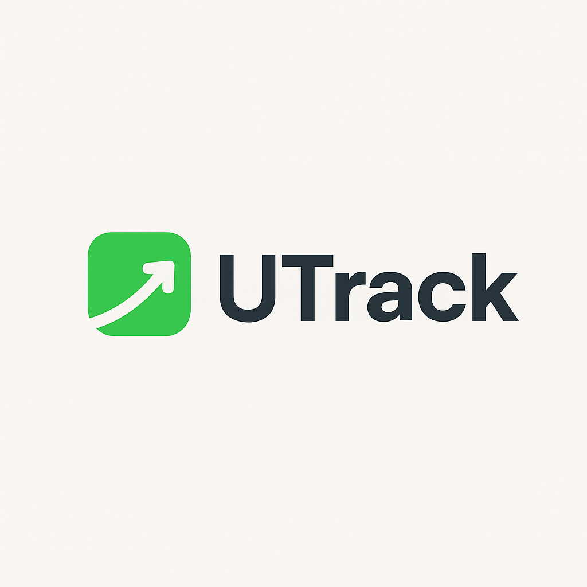

O **Utrack** é um sistema **SaaS de encurtamento de links corporativos**, desenvolvido para empresas que desejam organizar, proteger e analisar acessos a links de forma profissional.
Com recursos avançados de segurança, relatórios em tempo real e uma experiência de usuário fluida, o Utrack vai além do encurtador tradicional, oferecendo ferramentas de gestão e monitoramento.

---

## 🚀 Principais Recursos

* **Encurtamento de Links Personalizados**
  Crie links curtos e fáceis de compartilhar, com suporte a subdomínios exclusivos da sua empresa.

* **Segurança Avançada**

  * Defina **data de expiração** para o link.
  * Proteja acessos com **senha**.
  * Links privados que exigem autenticação antes do acesso.

* **Organização Inteligente**

  * Adicione **tags** para categorizar links.
  * Insira **comentários** para contextualizar cada link.
  * Facilite a busca e a gestão em escala.

* **Relatórios em Tempo Real (via Reverb)**

  * Acompanhe cliques à medida que acontecem.
  * Dados sempre atualizados sem necessidade de recarregar a página.

* **Compartilhamento Simples**

  * Gere QR Codes para os links.
  * Compartilhe com apenas um clique.

---

## 📊 Relatórios Disponíveis

O Utrack oferece relatórios detalhados para análise de acessos:

1. **Por Localidade**
   Visualize de onde seus links estão sendo acessados, com mapa interativo via **Leaflet**.
   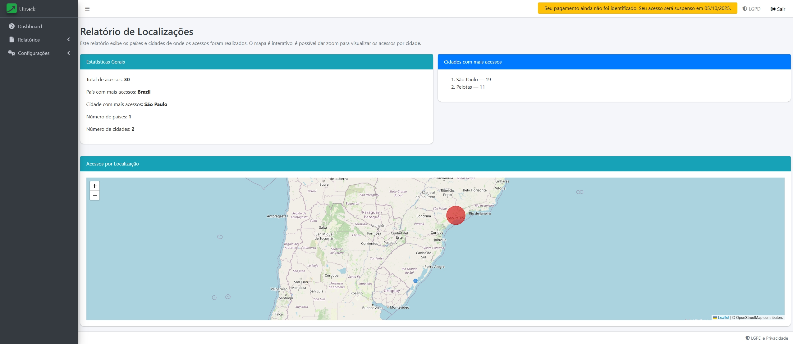

2. **Por Dispositivos e Navegadores**
   Entenda melhor os dispositivos e navegadores usados nos acessos.
   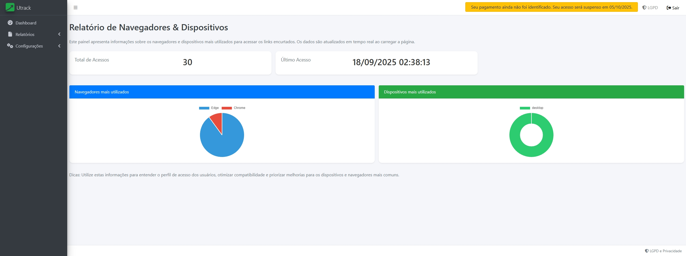

3. **Por Intervalo de Datas**
   Compare períodos específicos e visualize tendências de acessos.
   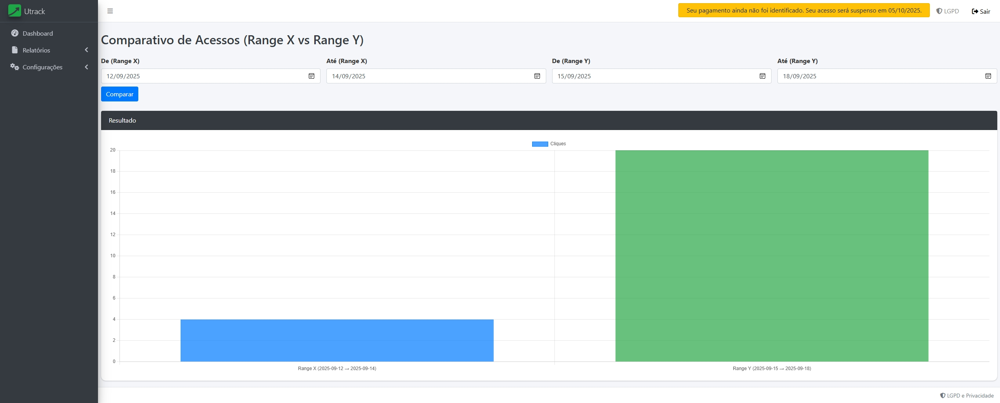

---

## 🖼️ Interface do Sistema

* **Página Inicial Pública**
  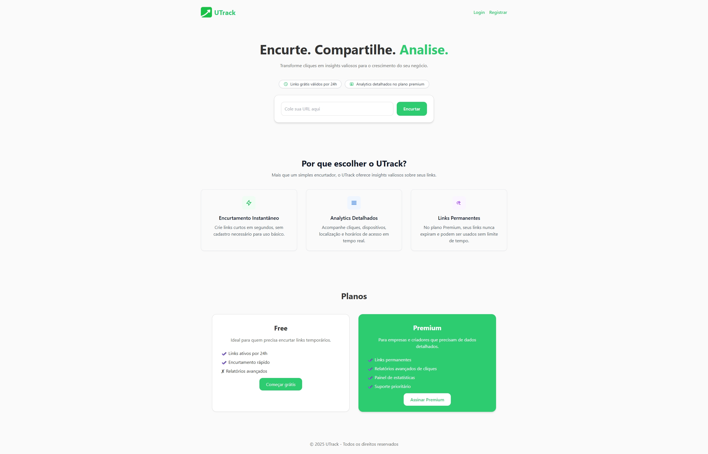

* **Registro em Etapas (Onboarding de Empresas)**

  * **Step 1**: Nome da empresa
    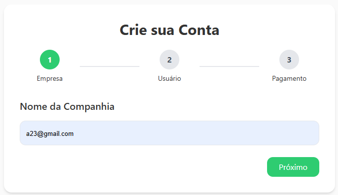
  * **Step 2**: Dados do usuário
    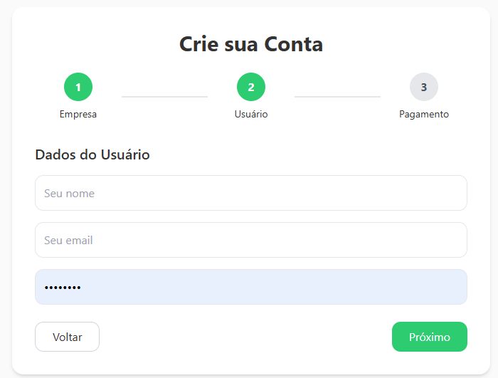
  * **Step 3**: Dados de pagamento
    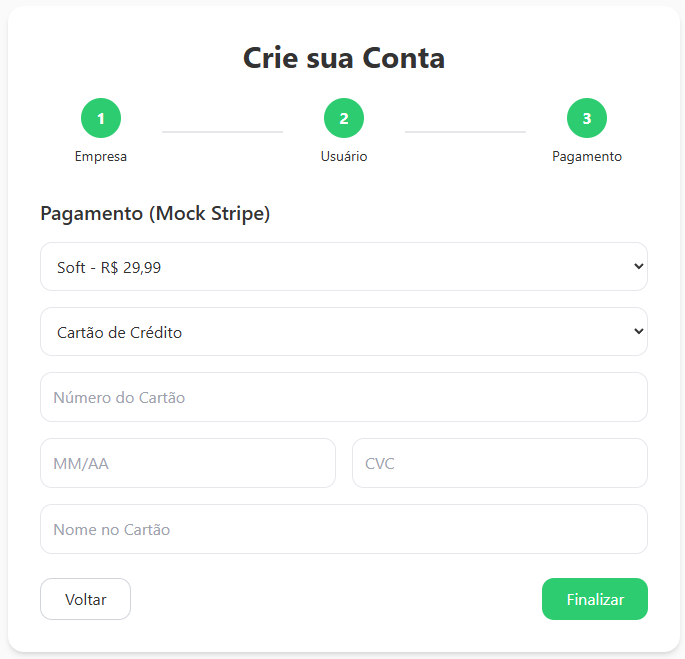

* **Login Público**
  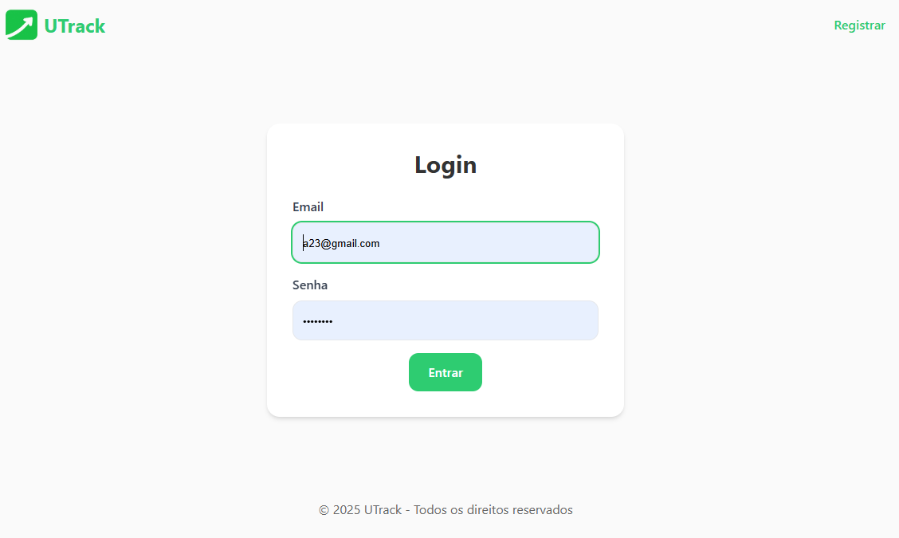

* **Dashboard com Indicadores**
  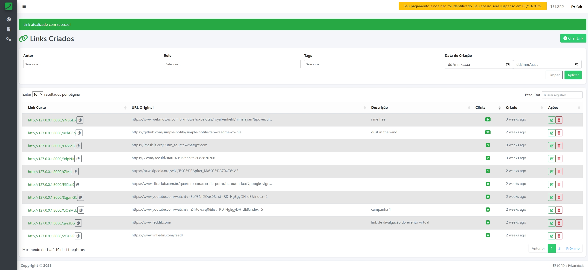

* **Modal de Criação de Link**
  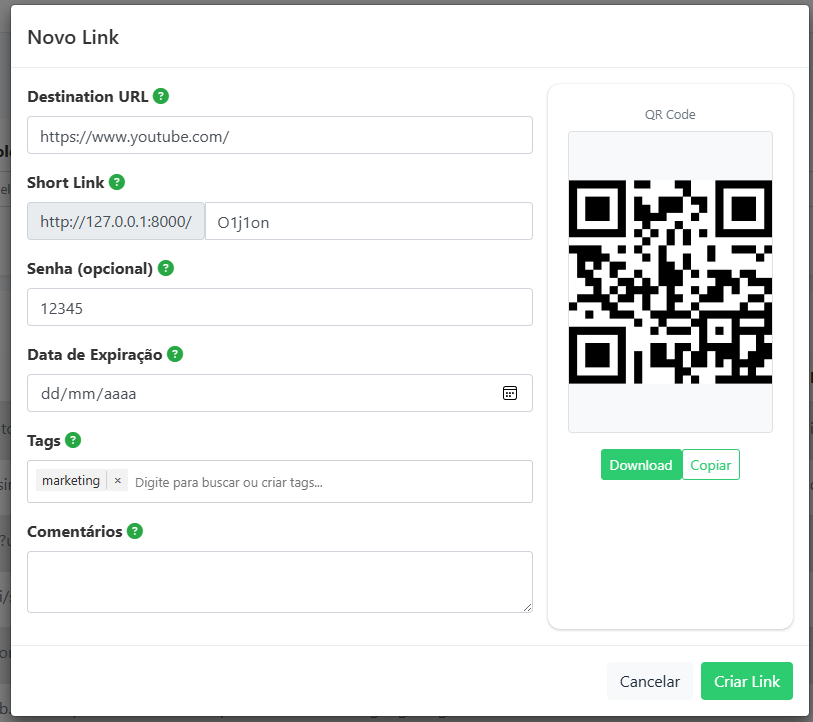

* **Página de Link Expirado**
  

* **Página de Link Protegido por Senha**
  

---

## 🛠️ Tecnologias Utilizadas

* **Backend**: PHP + Laravel
* **Banco de Dados**: MARIADB
* **Frontend**: AdminLTE + TailwindCSS
* **Realtime**: Laravel Reverb
* **Mapas**: Leaflet

---

## 📦 Instalação

1. Clone o repositório:

   ```bash
   git clone https://github.com/seu-org/utrack.git
   cd utrack
   ```

2. Instale as dependências:

   ```bash
   composer install
   npm install && npm run build
   ```

3. Configure o arquivo `.env`:

   ```env
   APP_NAME=Utrack
   APP_URL=http://utrack.test

   DB_CONNECTION=mariadb
   DB_HOST=127.0.0.1
   DB_PORT=5432
   DB_DATABASE=utrack
   DB_USERNAME=postgres
   DB_PASSWORD=secret

   BROADCAST_CONNECTION=reverb

   REVERB_APP_ID=
   REVERB_APP_KEY=
   REVERB_APP_SECRET=
   REVERB_HOST="localhost"
   REVERB_PORT=8080
   REVERB_SCHEME=http

   VITE_REVERB_APP_KEY="${REVERB_APP_KEY}"
   VITE_REVERB_HOST="${REVERB_HOST}"
   VITE_REVERB_PORT="${REVERB_PORT}"
   VITE_REVERB_SCHEME="${REVERB_SCHEME}"
   ```

4. Rode as migrations e seeders:

   ```bash
   php artisan migrate --seed
   ```

5. Inicie o servidor:

   ```bash
   php artisan serve
   php artisan reverb:start
   php artisan queue:work
   ```

---

## 🔐 Autenticação e Gestão de Empresas

* Cada empresa possui sua **própria conta SaaS**, podendo gerenciar equipes, definir roles e criar relatórios.
* O acesso à área administrativa só é liberado após o login.
* A área pública contempla o site de marketing e o processo de registro.

---

## 📈 Diferenciais do Utrack

* Relatórios em tempo real com **dados de acessos instantâneos**.
* Segurança robusta para links sensíveis.
* Interface amigável e moderna.
* Estrutura escalável para empresas de diferentes portes.
* Onboarding simplificado em **3 etapas**.

---

## 📄 Licença

Este projeto está sob a licença MIT. Consulte o arquivo `LICENSE` para mais detalhes.
